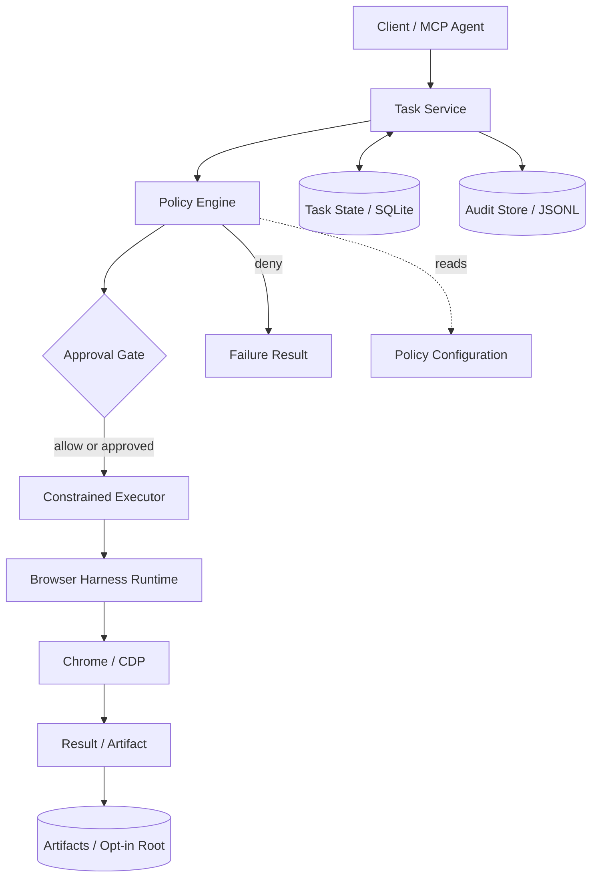
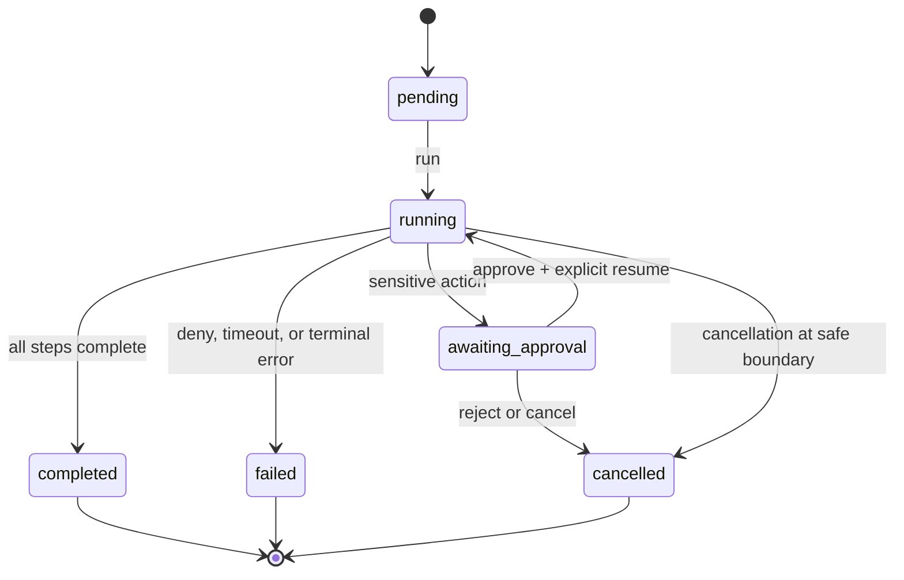

# Architecture

Avrixo BrowserOps adds a governance boundary around the inherited Browser Harness runtime. The upstream daemon, helpers, CDP connection, profile logic, and raw MCP server remain intact.

## Components

`BrowserOpsService` is the public service boundary. It validates task requests, rejects credential-bearing fields, normalizes policy configuration, persists the task, and delegates execution to `GovernedRuntime`.

`PolicyEngine` evaluates every action before the executor. Decisions are first-class values, not scattered booleans. Precedence is: task timeout, maximum steps, URL validity, blocked domains, allowed domains, download restrictions, sensitive-action classification, then allow.

`GovernedRuntime` owns lifecycle transitions, approval stops, bounded retry loops, cancellation boundaries, structured results, audit calls, and artifact metadata. It depends on a `BrowserExecutor` protocol so policy and state behavior can be tested without a real browser.

`HarnessExecutor` is the production adapter to inherited helpers. It accepts a constrained action vocabulary and generates extraction JavaScript internally from validated field schemas. Task callers cannot pass raw JavaScript, Python, CDP method names, shell commands, or artifact paths.

`TaskStore` uses SQLite because upstream has no application persistence layer. It is intentionally small and single-process oriented. Foreign keys connect sessions, steps, approvals, and artifacts to their task; `(task_id, sequence)` is unique.

`AuditTrail` is an append-only JSONL stream. `ArtifactStore` writes opt-in JSON beneath a resolved root with safe identifiers, atomic replacement, and path containment checks.

## Execution lifecycle

1. The client submits an objective, an ordered action plan, and policy configuration.
2. The service persists `BrowserTask(status=pending)`.
3. `run_task` opens or resumes one `BrowserSession`, checks cancellation and elapsed time, then evaluates the next incomplete action.
4. `deny` creates a failed step and terminates the task. `requires_approval` creates a pending `ApprovalRequest`, moves task/session/step state to `awaiting_approval`, and returns without executing.
5. Approval resolution only changes persisted approval state. A separate `run_task` call resumes execution, preventing approval from becoming an implicit action trigger.
6. Allowed or approved actions execute through the constrained adapter. Results and errors are sanitized before persistence and audit.
7. Completion writes a structured task result. JSON extraction, summary, and timeline artifacts are written only when `capture_artifacts=True`.

## Browser-session lifecycle

A session is created on the first run with the executor's browser target. It remains open in `awaiting_approval` so the same logical run can resume. Terminal task transitions close it with a terminal status and error/recovery metadata where relevant. This model does not promise that a remote browser process remains alive indefinitely while approval is pending; production deployments need a lease/reconnect strategy.

## MCP routing

The `avrixo-browser-ops-mcp` entry point exposes only task and approval operations. Each tool calls `BrowserOpsService`; therefore, MCP requests cannot skip policy evaluation or call raw JavaScript/CDP through this server.

The inherited `browser-harness-mcp` entry point is preserved separately for compatibility and attribution. Its raw helper tools are upstream functionality and are not represented as governed Avrixo tools.

## Retries, timeouts, and cancellation

- Executors classify safe transient failures as `RetryableExecutionError` and terminal failures as `NonRetryableExecutionError`.
- Total attempts are `1 + max_retries`, with a hard configuration cap of five retries.
- Cancellation is checked before every action and retry attempt.
- The runtime passes a step timeout budget to the executor and rejects results returned after that budget. The inherited synchronous helper boundary cannot forcibly terminate an in-flight Python call; therefore, timeout enforcement is cooperative, not preemptive.
- Task timeout is evaluated at every safe boundary using the durable start time.

## Failure modes and boundaries

- SQLite is not a distributed queue or multi-worker coordination system.
- Approval identity, authorization, notifications, and expiry are not implemented.
- Browser reconnection after process loss is delegated to inherited Browser Harness behavior; durable task state records the last safe boundary.
- A process crash during an external side effect may require operator reconciliation before retrying.
- Artifact capture is JSON-only in the governed layer. Upstream screenshot/recording tools remain available but are not enabled automatically.
- Live Chrome/CDP integration is opt-in because CI must not use a real user profile or depend on a workstation browser.
